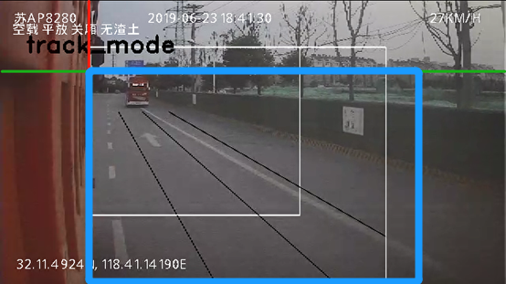
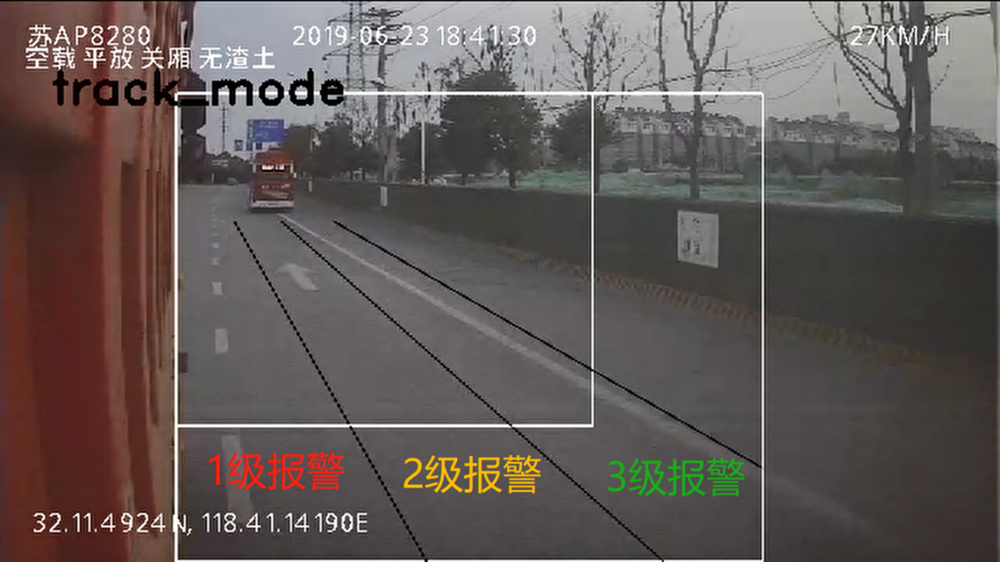

# APS

> APS是目前支持的算法功能包括```人脸比对```，```真·疲劳检测```。

> 配置文件位于```/sdcard/run/aps_setup.flag```

!> 真·疲劳检测为天迈客户提的基于DMS算法的定制化需求。

### 人脸比对算法
#### 可选配置
> 支持本地注册及平台下发（本地注册需一人一卡）
> 支持acc，定时，定距，速度，iccard，离岗，指令情况下比对

| 配置项 | 类型 | 配置项说明 | 单位 | 配置举例 |
| :----: | :----: | :----: | :----: | :----: |
| enable_enter_driver_info | bool | 是否运行驾驶员身份录入 |  | --enable_enter_driver_info=true |
| register_driver_try_times | int | 本地摄像头注册失败尝试次数 | | --register_driver_try_times=20 |
| enable_time_interval_compare | bool | 是否开启定时检测功能 |||
| change_match_or_not_interval | bool | 是否区分上次比对成功或者失败不同的时间间隔 |||
| driver_id_match_compare_interval | int | 比对成功情况下，下次比对时间间隔 | 毫秒 | --driver_id_match_compare_interval=20000 |
| driver_id_not_match_compare_interval | int | 比对失败情况下， 下次比对时间间隔 | 毫秒 | --driver_id_not_match_compare_interval=20000 |
| driver_id_compare_interval | int | 不区分成功失败情况，统一时间间隔比对 | 毫秒 | --driver_id_compare_interval=20000 |
| enable_speed_compare | bool | 是否开启定速比对 |||
| driver_id_compare_speed | int | 速度达到多少进行比对 | km/h | driver_id_compare_speed=10 |
| enable_acc_compare | bool | 是否开启acc比对 |||
| enable_distance_compare | bool | 是否开启定距比对 | 米 | --enable_distance_compare=100 |
| enable_commond_compare | bool | 是否开启指令检测 |||
| enable_iccard_compare | bool | 是否开启指令检测 |||
| enable_absense_compare | bool | 是否开启离岗检测 |||

#### 最新软件包依赖配置
- DFH2
  - DMS算法：https://setup.minieye.cc/packages/20072/versions/4324
  - 算法模型库：https://setup.minieye.cc/packages/20023/versions/4169
- M4
  - DMS算法：https://setup.minieye.cc/packages/4721/versions/4422
  - 算法模型库：https://setup.minieye.cc/packages/20023/versions/4169
- M5
  - DMS算法：https://setup.minieye.cc/packages/20045/versions/4519
  - 算法模型库：https://setup.minieye.cc/packages/20023/versions/4169
  
?> APS软件包取对应客户名称的最新版本即可

#### 控制台指令
> DFH2平台
>> 本地注册人脸 ```prot.cmd.register_face_v2 insert```  
>> 本地更新人脸 ```prot.cmd.register_face_v2 update```  
>> 清空数据库 ```prot.cmd.register_face_v2 delete```    
>> 人脸匹配 ```prot.cmd.trigger_match_v2```     
>> 设置车速(例子为设置80km/h) ```ndc prot cmd fakespd   800```    
>> 远程下发图片的处理 ```prot.cmd.register_face_v2 [insert/update/delete] [img_id] [mode] [path]```

> M5平台
>> 暂时不支持

### 真疲劳检测
#### 业务需求
1. 闭眼3秒以上，直接判断为真疲劳
2. 闭眼2秒以上flg=1，计数器加2，
     低头一次计数器加2，
     打哈欠一次计数器加1，
     flg由0变1时，定时器清0
     flg为1，计数器大于5，且定时器未超过10秒，即判断为真疲劳
     真疲劳的小视频取闭眼的视频。

#### 可选配置
| 配置项 | 类型 | 配置项说明 | 单位 | 配置举例 |
| :----: | :----: | :----: | :----: | :----: |
| function_real_tired_enable | bool | 开启真疲劳检测(包括区分左右的分神检测) |||
| real_tired_close_eye_threshold | int | 真疲劳闭眼阈值，若为0则关闭真疲劳检测 | 毫秒 | --real_tired_close_eye_threshold=20000 |
| close_eye_time_threshold | int | 轻度疲劳闭眼阈值 | 毫秒 ||
| bow_time_threshold | int | 低头时间阈值 | 毫秒 ||
| close_eye_mark | int | 轻度闭眼计分 |||
| bow_mark | int | 低头计分 |||
| yawn_mark | int | 打哈欠计分 |||
| mark_threshold | int | 真疲劳检测总分阈值 |||
| statistical_mark_time_threshold | int | 真疲劳检测时间段 | 毫秒 ||
| enable_lookright_alert | bool | 是否开启向右看分神 |||
| yaw_threshold | int | 左右分神角度 |||


# BSD

> 目前功能有BSD检测，摄像头遮挡，侧翻。   
BSD算法目前支持```单路BSD摄像头```，```两路BSD摄像头```

> BSD配置文件位于```/sdcard/run/bsd_setup.flag```   

#### BSD摄像头接口说明
- 单路BSD
  - DFH2 ：BSD
  - M5 ： BSD
- 两路BSD
  - DFH2 ：DMS & ADAS
  - M5 ：DMS & ADAS

!> 摄像头安装时候，需要进行标定，按照车身为数值标定线(180)，按天际线为水平标定线(180)，高度需要进行配置，默认1.7米。

如下图安装：    


分级区域图示：  


#### BSD播报声音及上报平台配置

| 配置项 | 类型 | 配置项说明 | 单位 | 配置举例 |
| :----: | :----: | :----: | :----: | :----: |
| alert_item_xxxx_enable | bool | 是否开启声音播报 | | --alert_item_xxxx_enable=true |
| alert_item_xxxx_speedth | int | 播报速度阈值即到达某速度才开始播报 | km/h | --alert_item_xxxx_speedth=10 |
| alert_item_xxxx_timeth | int | 声音延迟播放 | 毫秒 | --alert_item_xxxx_timeth=1000 |
| alert_item_xxxx_interval | int | 多次或循环播放时间间隔 | 毫秒 | --alert_item_xxxx_interval=4000 |
| alert_item_xxxx_loop | int | 循环播报次数，若为-1则一直循环播放 | | --alert_item_xxxx_loop=-1 |
| alert_item_xxxx_upload_interval | int | 此告警上传时间间隔 | 毫秒 | --alert_item_xxxx_upload_interval=120000 |
| camera_height | int | 安装高度，默认1.7米 | 米 | --camera_height=1.7 |

!> ```xxxx```为播报选项，替换相应内容即可，目前可替换的内容有```bsdleftlevel1```、```bsdleftlevel2```、```bsdleftlevel3```、```bsdrightlevel1```、```bsdrightlevel2```、```bsdrightlevel3```、```cameraoccation```、```rollover```、```fbsd```。

> 若单路BSD默认是右BSD，即配置```bsdrightlevel1```、```bsdrightlevel2```、```bsdrightlevel3```。若无分级告警，默认配置```bsdrightlevel1```。

配置文件举例
```bash 举例
--alert_item_bsdleftlevel1_enable=true
--alert_item_bsdleftlevel1_speedth=0
--alert_item_bsdleftlevel1_timeth=1000
--alert_item_bsdleftlevel1_interval=4000
--alert_item_bsdleftlevel1_loop=-1
--alert_item_bsdleftlevel1_upload_interval=120000
```

# FBSD
> 目前算法功能仅限于行人检测并没有分级告警。

> FBSD配置文件位于```/sdcard/run/fbsd_setup.flag```   

#### FBSD摄像头接口说明
- FBSD
  - DFH2 ：AVIN1
  - M5 ：DMS

#### FBSD播报声音及上报平台配置
跟BSD配置一样。[点击查看BSD](#BSD播报声音及上报平台配置)


# HOD
> 摄像头安装位于人头顶正上方
> HOD配置文件位于```/sdcard/run/hod_setup.flag```   

#### HOD摄像头接口说明
- HOD
  - DFH2 ：HOD
  - M5 ：HOD

#### HOD播报声音及上报平台配置
跟BSD配置一样，[点击查看BSD](#BSD播报声音及上报平台配置)。     

!> ```xxxx```为播报选项，替换相应内容即可，目前可替换的内容有```handsoff```、```singlehandoff```。


#### HOD可选配置项 
| 配置项 | 类型 | 配置项说明 | 单位 | 配置举例 | 默认 |
| :----: | :----: | :----: | :----: | :----: | :----: |
| need_driver_check | bool | 是否需要驾驶员检测(需要对应dms程序及dms摄像头) | | --need_driver_check=false | 关闭 |
| hod_judge_time_interval | int | hod程序检测时间间隔 | 毫秒 | --hod_judge_time_interval=3000 | 0 |
| hod_process_speed | int | 检测速度要求，即达到某速度才启动程序检测区分于达到某速度告警 | km/h | -- hod_process_speed=10 | 0 |